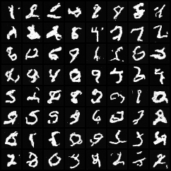

# CPU-generated examples

This grid contains samples from `../ddim.py`, not training images or externally
created illustrations. Each cell begins as independent Gaussian noise.

Training command (from the `ddim_mnist` folder):

```bash
python ddim.py --threads 4 train --epochs 20 --seed 42
```

Settings: all 60,000 MNIST training images, 20 epochs, batch size 128,
Adam with learning rate 0.001, 1,000 linear-schedule training timesteps,
and 50 deterministic DDIM sampling steps. The model has 59,633 parameters.
All training and sampling ran on CPU. Tested with Python 3.14.3,
PyTorch 2.14.1, torchvision 0.29.1 and Pillow 12.3.0.
Training took 3,391.7 seconds (about 57 minutes) on the machine used for this
example; other CPUs will differ. The mean training loss fell from 0.0778 to
0.0251. This run performed 9,380 optimizer updates.

### Seed 456 (64 generated images, 50 DDIM steps)



Trained checkpoints are excluded from Git. After running the training command
above, `../outputs/model.pt` contains the trained weights, schedule, seed,
epoch count, dataset size and per-epoch loss history.

Try a different random seed:

```bash
python ddim.py sample --seed 456
```

This is a small learning model: expect imperfect digits even after this longer
run. The previous examples used only 10,000 images for 15 epochs; this grid
replaces them with samples from the full-dataset, 20-epoch checkpoint. Each
training epoch uses a fixed sampling seed, keeping initial noise identical so
you can compare progress.
